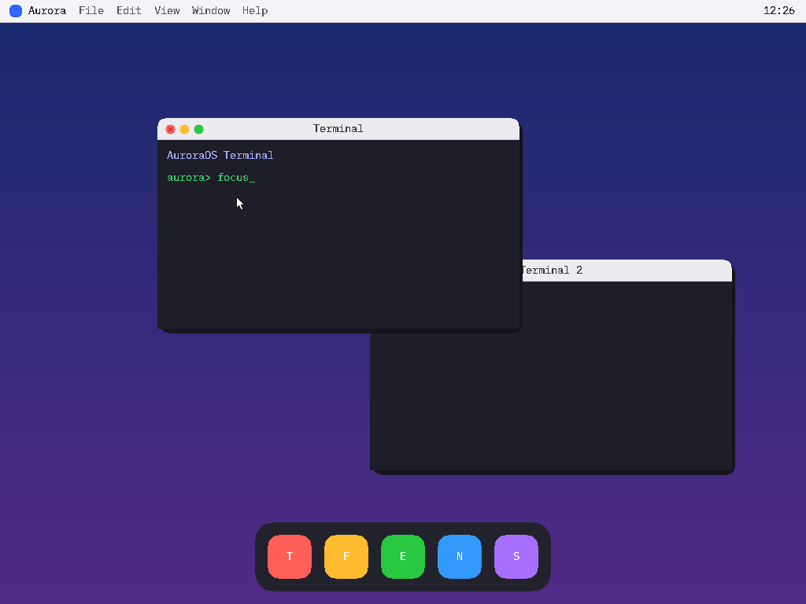

# AuroraOS — Project State

A snapshot of what AuroraOS is and what currently exists. For deeper detail see
[ARCHITECTURE.md](ARCHITECTURE.md), the technical specs in [`docs/`](docs/), and
the forward plan in [NEXT_STEPS.md](NEXT_STEPS.md).

## What it is

AuroraOS is a from-scratch, 32-bit (i686) operating system: a monolithic kernel
with a Unix-like userland. It boots in QEMU, runs ELF programs in ring 3, has a
filesystem stack, an interactive shell, pipes, a small libc, a userspace
service model (init + daemons + message-passing IPC), and loopback sockets
brokered by a userspace network daemon.

It has moved well past a "teaching kernel" — **v1.0.0 was the first stabilized
release** (a functional GUI OS hardened by a memory/process/IPC audit, see
[docs/STABILITY.md](docs/STABILITY.md)); **v1.1.x** grows the desktop environment
— a complete window model (**minimize/maximize** via a `WM_RESIZE` resize protocol,
on top of close/focus/drag), an **Aurora system menu** (About / Settings / Close
All Windows / Shut Down) and a **Settings** app (wallpaper + accent theme saved to
`/disk/settings.cfg` and applied live; a System info pane). It is an early
Unix-like execution environment that looks like a platform of services, with the
first slice of its macOS-like visual stack: a framebuffer, a 2D library with an
8×16 font, and a **userspace window server** with an event loop that takes
keyboard **and mouse** input and interactive Terminal apps — **confirmed running
live in QEMU** (desktop, windows, on-screen keyboard echo, a moving cursor,
click-to-focus, **title-bar window dragging**, a **close button**, a **Dock that is
its own process** — a borderless GUI client that launches apps on click — a
**Finder (`Aurora Files`)** that browses the filesystem and opens/launches files,
and a **Text Viewer** that renders a file's contents and scrolls with the arrow
keys), with a **double-buffered, damage-driven compositor** that repaints only the
rectangles that change rather than the whole screen on every event. It is **not**
yet a daily-driver OS (no external networking yet — loopback only; a basic
permission model — uid + rwx — but no login/groups). The desktop environment is
nearly complete; the last v1.1 piece is a clipboard (10.4), after which come
networking (virtio-net → TCP) and shared-memory surfaces in v2.0.

- **Current version:** v1.1.2
- **Size:** ~6,800 lines of C / assembly (plus a generated 8×16 font header)
  across kernel + drivers + fs + libc + userland.
- **Target:** i686 protected mode, Multiboot1, booted directly by
  `qemu-system-i386 -kernel`.
- **Toolchain:** `clang` as a cross-compiler (no separate cross-gcc), `ld.lld`,
  Python helpers for the embedded blob and the FAT32 image. No `nasm`/`grub`
  required.

## Implemented, by layer

| Layer | Status | Highlights |
|-------|--------|-----------|
| Boot | ✅ | Multiboot1 header, `_start`, stack, jump to C. |
| CPU/arch | ✅ | GDT + TSS, IDT, ISR/IRQ stubs, PIC remap. |
| Drivers | ✅ | VGA text console, COM1 serial, PS/2 keyboard (+ extended scancodes: arrows/PgUp/PgDn) + mouse, PIT timer, ATA PIO disk, linear framebuffer. |
| Memory | ✅ | E820 parse, bitmap PMM, paging (recursive), per-process address spaces, kernel heap, `sbrk`. |
| Scheduling | ✅ | Preemptive round-robin threads, run states, block/wake, idle thread, context switch. |
| Processes | ✅ | PCB, `fork`/`exec`/`wait`/`exit`, exit codes, reparent-to-init, zombie reaping, `kill`. |
| Ring 3 | ✅ | User mode via TSS + `iret`, `int 0x80` syscalls (37 calls). |
| Filesystem | ✅ | VFS (mounts, vnodes, ops, rwx/owner); tmpfs (rw); FAT32 **read/write** over ATA (create/grow/truncate); console device. |
| Executables | ✅ | ELF32 loader (PT_LOAD), `argc`/`argv` setup, crt0. |
| IPC | ✅ | Pipes (`pipe`/`dup2`), message passing (`msgsend`/`msgrecv`), named service registry. |
| Sockets / poll | ✅ (8A) | Kernel `struct socket` (AF_LOOPBACK), `socket`/`poll`; `netd` brokers bind/connect/accept over IPC; `sock_link` joins endpoints. |
| Userland | ✅ | mini libc; `init`, `logger`, `netd`, `sh`, `cat`, `grep`, `hello`, `orphan`, `echosrv`, `echocli`, `save`, `wserver`, `term`, `dock`, `files` (Finder), `viewer` (Text Viewer), `settings` (control panel), `wmstress` (WS self-test). |
| Networking (NIC/IP) | ⏳ | Loopback done (8A); Ethernet/ARP/IP/UDP/TCP is 8B. |
| Graphics | ✅ (9.0–10.3) | Linear framebuffer (Multiboot **or** Bochs-VBE via PCI); 2D library (+ **8×16 text**); themeable desktop; **event-driven userspace `windowserver`** (damage-driven compositor) + **keyboard & mouse pipelines** + Terminals + a **standalone Dock** + a **Finder** + a **Text Viewer** + a **Settings** app (surfaces, z-order, focus, window IPC, **cursor + click-to-focus + title-bar dragging + close/minimize/maximize + Aurora system menu + Settings/themes + pointer forwarding + Dock click-to-launch + `readdir` + text rendering & scroll**). **Live-confirmed in QEMU** (`make demo-focus/drag/close/dock/files/view/max/min/menu/settings`). Clipboard next. |
| Security / multi-user | 🟡 (8A.5) | uid (root vs user, `getuid`/`setuid`/`uid_of`); rwx + owner on VFS nodes enforced at open/exec; service registry permissions; privileged ports (<1024) root-only. No login/groups yet. |

## What it looks like

The live AuroraOS desktop — a **real framebuffer capture from QEMU** showing
mouse **click-to-focus**: two overlapping Terminals, where the (initially back)
window was clicked with the mouse — raising it to the front — and then typed into
(`aurora> focus`), with the arrow cursor visible. Regenerate with
`make demo-focus`:



The keyboard-only capture (`make verify-gui` → `aurora_live_typed.png`), the plain
desktop (`make live-shot` → `aurora_live.png`), the host preview of the desktop
(`make screenshot` → `aurora_desktop.png`), and the compositor z-order test
(`make screenshot-wm` → `aurora_windows.png`) are also in the repo.

## What you can do today

Boot and get an interactive shell that composes real programs:

```
aurora> hello one two            # argv + malloc demo
aurora> cat /disk/poem.txt | grep aurora   # pipes between two processes
aurora> log system online        # IPC message to the logger daemon
aurora> id                       # shows uid=1000 (the shell runs unprivileged)
aurora> echosrv &                # loopback echo server (binds port 7000 via netd)
aurora> echocli hello-loopback   # client -> netd -> server -> back
aurora> save /disk/NOTE.TXT hi   # write a file to disk (FAT32 write)
aurora> cat /disk/NOTE.TXT       # read it back (persists across reboot)
aurora> orphan                   # orphan reparented to init and reaped
aurora> hello job &              # background job, auto-reaped
aurora> exit                     # graceful shutdown of services
```

## Build & run

```sh
make          # builds aurora.elf + disk.img (kernel, user programs, FAT32 image)
make run      # text shell in QEMU (qemu -kernel; serial log on stdio)
make run-vbe  # GUI desktop in QEMU, no GRUB tools (Bochs-VBE fallback)
make gui      # GUI desktop via GRUB ISO (build + iso + qemu); needs grub-mkrescue
make live-shot      # boot headless + capture the live framebuffer -> aurora_live.png
make verify-gui     # like live-shot, but type into the Terminal first (proves keyboard)
make demo-focus     # move the mouse, click the back window to focus it, then type
make demo-drag      # grab the front Terminal by its title bar and drag it
make demo-close     # click the front Terminal's red close button (window exits)
make demo-dock      # click the Dock's Terminal icon -> the Dock launches a Terminal
make demo-files     # open the Finder from the Dock, list /disk, launch TERM.ELF from it
make demo-view      # open the Finder, double-click ABOUT.TXT -> the Viewer renders + scrolls it
make demo-max       # click a Terminal's green light -> maximize it to fill the screen
make demo-min       # click a Terminal's yellow light -> window-shade it to its title bar
make demo-menu      # click "Aurora" in the menu bar -> the system menu drops down
make demo-settings  # Aurora menu -> Settings -> pick a wallpaper + accent (live retheme)
make stress         # window-server leak/limit self-test (heap stays flat; see docs/STABILITY.md)
make screenshot     # render the desktop to aurora_desktop.png (no QEMU needed)
make screenshot-wm  # render the compositor (two windows) to aurora_windows.png
make debug    # text boot, waits for GDB on :1234
make clean
```

Interactive input in headless QEMU can be driven via the monitor `sendkey`
command (see the session history / NEXT_STEPS for how tests are run).

## Repository map

```
arch/i386/   CPU/arch: boot, GDT/TSS, IDT, ISR, PMM, paging, context switch, ring3
drivers/     vga, serial, keyboard, mouse (PS/2), pit, ata, console, fb (framebuffer + VBE)
fs/          vfs, tmpfs, fat32
lib/         freestanding kernel lib: string, printf (kprintf), kheap
kernel/      kmain, scheduler, process, pipe, socket, elf, syscall, gfx, desktop, font8x16.h
include/     kio.h, multiboot.h, syscall_abi.h (shared ABI), syscall.h, keys.h
             (special key codes), net.h (netd protocol)
user/        crt0, libc (libc.h + libc/), wm (windowserver core: wm.h + wm.c),
             programs (init, logger, netd, sh, cat, grep, hello, orphan,
             echosrv, echocli, save, wserver (windowserver), term (Terminal),
             dock (Dock — borderless GUI client, click-to-launch),
             files (Finder / Aurora Files — readdir-based file browser),
             viewer (Text Viewer — open/read/render + scroll),
             settings (control panel: wallpaper/accent + System info),
             wmstress (window-server leak/limit self-test), about.txt)
boot/        grub.cfg (for the `make iso` GRUB boot path)
tools/       bin2c.py (embed ELF), mkfat32.py (FAT32 image), render_desktop.c +
             render_wm.c + ppm2png.py (host -> PNG), genfont.py (8×16 font header),
             screendump.py (headless live-framebuffer capture via the QEMU monitor)
docs/        ABI, SYSCALLS, PROCESS_MODEL, VFS, IPC, NETWORKING, GRAPHICS, INPUT, STABILITY
linker.ld    kernel link map (load at 1 MiB)
Makefile     clang/lld cross-build + user programs + disk image
```

> `index.php` is a leftover from the original empty repository and is unrelated
> to the OS.

## Version history

See [CURRENT_STATUS.md](CURRENT_STATUS.md) for the phase-by-phase table.
