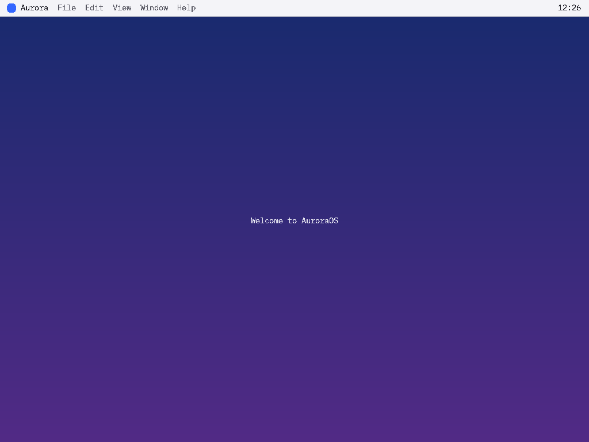
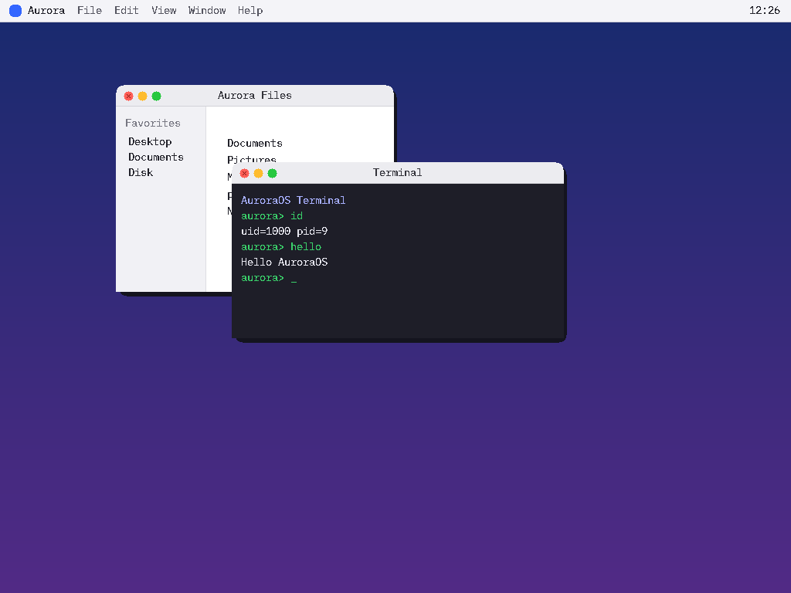

# AuroraOS

Учебная операционная система, написанная с нуля: собственное ядро,
загружаемое в QEMU. Долгосрочная цель — десктоп-ОС в духе macOS со своей
«изюминкой» (варианты обсуждаются в [ROADMAP.md](ROADMAP.md)).

Это **версия 1.0.0** — первый стабилизированный релиз: функциональная GUI-ОС с
сервисной моделью, сокетами loopback, базовой безопасностью, записью на диск
(FAT32 read/write) и полным **графическим стеком**: линейный фреймбуфер
(Multiboot или Bochs-VBE), 2D-библиотека с **текстом (8×16)**, рабочий стол и
**event-driven userspace-`windowserver`** (damage-композитор) с **клавиатурным и
мышиным контурами**, интерактивным **Terminal**, **курсором + click-to-focus**,
**перетаскиванием окон за заголовок** и **кнопкой закрытия**, отдельным
процессом **Dock** (click-to-launch), файловым менеджером **Finder (Aurora
Files)** и **текстовым Viewer** — цепочка Dock → Finder → файл → Viewer.
Перед релизом пройден **аудит стабильности** (утечки памяти/процессов/IPC,
лимиты — см. [`docs/STABILITY.md`](docs/STABILITY.md)). Живой вывод:
`make run-vbe` или `make gui`. Конечная цель — desktop-ОС в духе macOS. Ядро запускает
**init (PID 1)**, который поднимает **logger**, **netd** и **shell**. Есть
**message-passing IPC**, **реестр сервисов** с правами, **сокеты `AF_LOOPBACK`**
через `netd`, **uid + rwx на VFS**, привилегированные порты, **запись файлов на
диск** и **графика** (`make screenshot`). Архитектура — в [`docs/`](docs/).



> Рабочий стол AuroraOS (`make screenshot`). Ниже — userspace-композитор
> раскладывает два окна по z-order (`make screenshot-wm`):



> Имя `Aurora` — рабочее, его легко поменять (см. `kernel/kmain.c` и Makefile).

## Что уже работает

**Ядро и прерывания (v0.1)**
- **Загрузка через Multiboot1** — ядро стартует напрямую из `qemu -kernel`,
  без GRUB.
- **VGA текстовый терминал** (80×25) с цветами, скроллингом и аппаратным
  курсором.
- **Логирование через serial-порт (COM1)** — удобно отлаживать в QEMU.
- **GDT** — плоская модель памяти, сегменты ядра и пользователя (ring 0/3).
- **IDT + обработчики прерываний** — все 32 исключения CPU и 16 аппаратных
  IRQ, перемаппинг PIC.
- **Таймер (PIT)** на 100 Гц (IRQ0).
- **PS/2 клавиатура** (IRQ1) — ввод печатается на экран.
- **Мини-`kprintf`** (`%c %s %d %u %x %X %p`), пишет на экран и в serial.

**Память и многозадачность (v0.2)**
- **Карта памяти (Multiboot E820)** — разбор регионов BIOS.
- **Физический аллокатор страниц (PMM)** — bitmap-аллокатор кадров 4 KiB.
- **Виртуальная память + paging** — двухуровневые таблицы, рекурсивное
  отображение, идентичное отображение ядра, включение CR0.PG.
- **Куча ядра** — `kmalloc`/`kfree` (first-fit, разбиение и слияние блоков),
  страницы подгружаются по требованию.
- **TSS + Ring 3** — переход в пользовательский режим (`enter_user_mode`).
- **Системные вызовы** — шлюз `int 0x80` (`SYS_PUTC`, `SYS_YIELD`, `SYS_EXIT`).
- **Планировщик процессов** — вытесняющий round-robin для потоков ядра,
  переключение контекста по тику таймера.

**Файлы и процессы (v0.3)**
- **VFS** — точки монтирования, узлы (inode-подобные), таблица операций ФС.
- **tmpfs** — файловая система в памяти (создание/чтение/запись/readdir).
- **ATA PIO** — драйвер диска (primary master, LBA28, чтение секторов).
- **FAT32 (read-only)** — монтирование образа диска QEMU, чтение файлов и
  каталогов.
- **ELF-загрузчик** — разбор заголовков, загрузка сегментов PT_LOAD в
  пользовательскую память, точка входа.
- **Процессы v2** — процесс = адресное пространство + поток; **свой page
  directory на процесс**, общий код/куча ядра; `process_spawn(elf)`.
- **Пользовательские программы** — собираются отдельными ELF, кладутся на
  FAT32-диск и грузятся ядром в Ring 3.

**Unix-подобная модель процессов (v0.4)**
- **PCB** — процесс = адресное пространство + page directory + таблица
  файловых дескрипторов + состояние + поток.
- **Жизненный цикл** — `spawn → running → zombie → reaped`, корректная
  очистка (адресное пространство, kstack, PCB).
- **`fork()`** — копия процесса (адресное пространство + дескрипторы), ребёнок
  получает 0, родитель — pid.
- **`exec(path)`** — замена образа процесса новым ELF.
- **`wait(pid)`** — родитель блокируется и забирает код выхода ребёнка.
- **Файловые дескрипторы** — таблица в PCB, `open/read/write/close`, наследуются
  при `fork`.
- **STDIO** — 0/1/2 (stdin/stdout/stderr) подключены к консоли (клавиатура +
  терминал) через VFS.

**Интерактивный shell (v0.5)**
- **Зафиксированный syscall-контракт** — `include/syscall_abi.h`, общий для ядра
  и userland (`read/write/open/close`, `fork/exec/wait`, `exit`, `getpid`).
- **crt0** — `_start` настраивает `argc`/`argv` и вызывает `main`.
- **Передача аргументов** — `exec(path, argv)` строит `argc`/`argv` на стеке
  нового процесса.
- **Shell** (`user/sh.c`) — цикл `prompt → read → tokenize → fork → exec →
  wait`, builtins `help`/`exit`, фоновые процессы `&`, обработка ошибок
  («command not found»).
- **idle-поток** — всегда готов к выполнению, чтобы IRQ будили заблокированные
  процессы.

**IPC и libc (v0.6)**
- **Пайпы** — `pipe()` (кольцевой буфер с блокировкой), `dup2()`, `close()` с
  подсчётом ссылок read/write-концов и EOF. Shell поддерживает `a | b`.
- **`sbrk()`** — рост пользовательской кучи по требованию (per-process brk).
- **Мини-libc** (`user/libc/`) — `printf`/`fprintf`, `malloc`/`free` (поверх
  sbrk), строковые функции, обёртки системных вызовов.
- **Утилиты** — `cat` (файл/stdin → stdout), `grep` (фильтр строк stdin),
  `hello` (демо argv/malloc).

**Init и сервисы (v0.7)**
- **init (PID 1)** — `user/init.c`: запускает logger и shell, в цикле `wait`
  реапит детей и перезапускает упавшие демоны; при выходе shell — shutdown.
- **logger** — `user/logger.c`: демон, регистрируется как сервис `log`,
  принимает сообщения по IPC и печатает их.
- **Message-passing IPC** — `msgsend(pid)`/`msgrecv()` (почтовые ящики
  процессов с блокировкой).
- **Реестр имён** — `register(name)`/`lookup(name)`: сервисы находят друг друга
  по имени, без хардкода pid. Shell: builtin `log <msg>`.
- **Жизненный цикл (v0.7.1)** — reparenting сирот к init, авто-reap фоновых
  процессов (`cmd &`, неблокирующий `wait`), `kill(pid)`, graceful shutdown
  (init → `shutdown`-сообщение сервисам → wait → force-kill).
- **Документация** — [`docs/ABI.md`](docs/ABI.md),
  [`docs/SYSCALLS.md`](docs/SYSCALLS.md),
  [`docs/PROCESS_MODEL.md`](docs/PROCESS_MODEL.md),
  [`docs/VFS.md`](docs/VFS.md), [`docs/IPC.md`](docs/IPC.md).

**Сокеты loopback + netd (v0.8 / Этап 8A)**
- **Ядро — только механизм** — `struct socket` (`kernel/socket.c`): двунаправленный
  endpoint поверх VFS-узла (значит `read`=recv, `write`=send, `close`, `poll`).
  Ядро ничего не знает про порты/адреса/протоколы.
- **netd — это «стек»** — `user/netd.c`: демон, регистрируется как `net`, владеет
  пространством портов `AF_LOOPBACK` и сводит `bind`/`connect`/`accept` через
  message-IPC, затем соединяет два endpoint привилегированным `sock_link`
  (только root). Данные дальше идут endpoint↔endpoint, не через netd.
- **API сокетов** — `socket`/`poll` — это syscalls; `bind`/`listen`/`connect`/
  `accept` — RPC к netd (`user/libc/net.c`). `send`/`recv` = `write`/`read`.
- **`poll()`** — ожидание готовности дескрипторов (`POLLIN`/`POLLOUT`/`POLLERR`).
- **Демо** — `echosrv` (эхо-сервер на порту 7000) и `echocli` (клиент):
  `client → netd → server → обратно`.
- **Документация** — [`docs/NETWORKING.md`](docs/NETWORKING.md).

**Базовая безопасность (v0.8.1 / Этап 8A.5)** — зафиксирована *до* сети, пока
attack surface мал:
- **uid** — у процесса есть `uid` (наследуется через fork/exec); сервисы —
  root (0), shell и его дети — uid 1000 (`id`); `setuid` только понижает права;
  `uid_of(pid)` отдаёт uid процесса из ядра (для демонов).
- **rwx на VFS** — у узлов есть `owner_uid` + Unix-`mode`; `open` проверяет
  R/W, `exec` — X (root в обход). `/disk` — root, `0755`.
- **Права сервисов** — у сервиса есть владелец и mode; «read» гейтит `lookup`;
  перерегистрировать имя может только владелец/root (нет захвата имени).
- **Привилегированные порты** — `bind` порта < 1024 только для root (netd
  спрашивает uid у ядра через `uid_of`, его нельзя подделать; демо — порт 7000).
- **Документация** — [`docs/VFS.md`](docs/VFS.md), [`docs/IPC.md`](docs/IPC.md).

**Запись на диск (v0.8.2 / FS write)**
- **ATA write** — `ata_write_sectors` (+ сброс кэша записи).
- **FAT32 read/write** — создание файла в корне, рост цепочки кластеров,
  перезапись/усечение, обновление размера и first-cluster в dir-entry и в
  **обеих** копиях FAT.
- **`open(O_CREAT|O_TRUNC)`** — с проверкой прав на запись в каталог; новый файл
  принадлежит создателю (`0644`).
- **Демо** — `save /disk/NOTE.TXT привет` → `cat /disk/NOTE.TXT` (файл переживает
  перезагрузку). Ограничения: пока только корневой каталог, без удаления и
  освобождения кластеров, без блок-кэша.
- **Документация** — [`docs/VFS.md`](docs/VFS.md).

**Графика — первый рабочий стол (v0.9.0 / Этап 9.0–9.1)**
- **Фреймбуфер** (`drivers/fb.c`) — линейный режим 1024×768×32 через Multiboot;
  гейтится (без фреймбуфера — текстовый режим, загрузка не ломается).
- **2D-библиотека** (`kernel/gfx.c`) — прямоугольники, скругления, круги,
  градиент, blit и **текст** 8×16 (`kernel/font8x16.h`, генерится
  `tools/genfont.py`). Без альфы пока.
- **Рабочий стол** (`kernel/desktop.c`) — обои-градиент, панель с «Aurora» и
  меню, часы, Dock с буквами на иконках. Рисуется один раз из `kmain`.
- **Превью без дисплея** — `make screenshot` рендерит реальный код ядра в
  `aurora_desktop.png` (через `tools/render_desktop.c` + `tools/ppm2png.py`).
- **Живой вывод в QEMU** — `make run-vbe` (проще всего: только QEMU, без GRUB,
  ядро само ставит VBE-режим) **или** `make gui` (build + GRUB ISO + запуск
  одной командой; нужны `grub-mkrescue`/`xorriso`/`mtools`).
- **Документация** — [`docs/GRAPHICS.md`](docs/GRAPHICS.md).

**Window Server (Этапы 9.2–9.5) — event-driven userspace-процесс, не в ядре**
- **`windowserver`** (`user/wserver.c`) — демон (`wm`), единый event loop;
  **единственный писатель в framebuffer**; полный recomposite на каждый
  `PRESENT`; протокол окон (`WM_CREATE/DESTROY/MOVE/DRAW_RECT/DRAW_TEXT/PRESENT`).
  Ядро добавляет `fb_map` + `fb_active`.
- **Клавиатурный и мышиный контуры** — forked-reader'ы (`read(0)` и `SYS_MOUSE`) →
  `WM_KEY`/`WM_MOUSE` → фокусное окно → перерисовка: `input → windowserver → app → screen`.
- **Surface-модель + хром** (`user/wm.c`) — у каждого окна свой буфер; title bar,
  traffic-lights (с «×» на красной — это закрытие), тень; композитинг по `z`.
- **Курсор + click-to-focus + drag + close (9.3–9.5)** — стрелка рисуется поверх
  всего; клик поднимает окно (`wm_raise`); зажатие на заголовке тащит окно
  (`wm_move_clamped`, с ограничением по экрану/меню-бару); клик по красной кнопке
  (`wm_in_close_button`) уничтожает окно и шлёт владельцу `WM_DESTROY`.
- **Terminal** (`user/term.c`) — интерактивный: эхо-печатает ввод, выходит по
  `WM_DESTROY`. `init` в графике запускает windowserver + два Terminal (без shell).
- **Проверки на экране** — `make screenshot-wm` (логика `wm_state`), `make demo-focus`,
  `make demo-drag`, `make demo-close`; `tools/verify_drag.py` — пиксельные ассерты.

## Стек сборки

Используется **clang как кросс-компилятор** (не нужен отдельный cross-gcc)
и линкер **lld**. Цель — bare-metal `i686-elf`.

| Инструмент | Назначение            |
|------------|-----------------------|
| `clang`    | компилятор C и ассемблер (GAS-синтаксис) |
| `ld.lld`   | линковка ELF i386     |
| `qemu-system-i386` | запуск/отладка |

## Сборка и запуск

```sh
make            # собрать aurora.elf
make run        # запустить в QEMU (serial-лог в терминал)
make debug      # то же, но ждёт GDB на :1234 (qemu -s -S)
make clean      # очистить
```

Безголовый прогон с логом ядра:

```sh
qemu-system-i386 -kernel aurora.elf -serial stdio -display none
```

## Структура проекта

```
arch/i386/      архитектурно-зависимый код (x86)
  boot.S        Multiboot-заголовок и точка входа _start
  gdt.*         глобальная таблица дескрипторов + TSS
  idt.*         таблица дескрипторов прерываний
  isr.*         обработчики исключений и IRQ, перемаппинг PIC, шлюз syscall
  interrupt.S   ассемблерные «заглушки» прерываний
  pmm.*         физический аллокатор страниц (bitmap)
  paging.*      виртуальная память / paging + адресные пространства процессов
  switch.S      переключение контекста потоков
  usermode.S    вход в ring 3
  io.h          порты ввода-вывода (inb/outb)
drivers/        драйверы устройств
  vga.c         текстовый терминал
  serial.c      COM1
  keyboard.c    PS/2 клавиатура
  pit.c         системный таймер (+ хук планировщика)
  ata.c         ATA PIO дисковый драйвер
  console.c     консольное устройство (stdin/stdout) как VFS-узел
fs/             файловые системы
  vfs.c         слой VFS (монтирование, разрешение путей)
  tmpfs.c       ФС в памяти
  fat32.c       FAT32 read-only
lib/            свободная от ОС библиотека
  string.c      memcpy/memset/memcmp/...
  printf.c      kprintf, kputchar
  kheap.c       куча ядра (kmalloc/kfree)
kernel/
  kmain.c       точка входа ядра, инициализация подсистем
  scheduler.c   планировщик потоков (состояния, block/wake)
  process.c     модель процессов: PCB, fork/exec/wait/exit, дескрипторы, sbrk
  pipe.c        анонимные пайпы (кольцевой буфер)
  elf.c         ELF-загрузчик
  syscall.c     диспетчер системных вызовов
user/           пользовательские программы (собираются отдельно)
  crt0.S        стартап C (_start -> main(argc, argv))
  libc.h        заголовок мини-libc (обёртки syscall + прототипы)
  libc/         реализация libc (string.c, printf.c, malloc.c)
  init.c        init (PID 1): запуск и супервизия сервисов
  logger.c      демон логирования (сервис "log")
  sh.c          интерактивный shell (пайпы, builtins, фон, log)
  hello.c       демо argv + malloc
  cat.c grep.c  утилиты (для 'cat | grep')
  orphan.c      тест reparenting (сирота → init)
  poem.txt      тестовый текст на диск
docs/           архитектурная документация (ABI, syscalls, процессы, VFS, IPC)
tools/          утилиты сборки
  bin2c.py      встраивание ELF в образ ядра
  mkfat32.py    генератор FAT32-образа диска
include/        общие заголовки (kio.h, multiboot.h, syscall_abi.h)
linker.ld       карта памяти ядра (загрузка с 1 MiB)
Makefile
```

## Как это загружается

1. QEMU находит Multiboot-заголовок в `.multiboot` и передаёт управление в
   `_start` (`arch/i386/boot.S`) в 32-битном защищённом режиме.
2. `_start` настраивает стек и вызывает `kernel_main` (`kernel/kmain.c`).
3. `kernel_main` поднимает GDT → IDT → обработчики прерываний → таймер →
   клавиатуру, включает прерывания (`sti`) и уходит в `hlt`-цикл.

Дальнейшие планы — в [ROADMAP.md](ROADMAP.md).
